<div align="center">

<br>

```
 ████████╗███████╗██████╗ ███████╗███████╗
    ██╔══╝██╔════╝██╔══██╗██╔════╝██╔════╝
    ██║   █████╗  ██████╔╝███████╗█████╗
    ██║   ██╔══╝  ██╔══██╗╚════██║██╔══╝
    ██║   ███████╗██║  ██║███████║███████╗
    ╚═╝   ╚══════╝╚═╝  ╚═╝╚══════╝╚══════╝
```

**Token optimization framework for LLM developers.**<br>
Cut API costs 40–70% without changing how you write prompts.

<br>

[](https://npmjs.com/package/@terse-ai/sdk)
[](LICENSE)
[](package.json)
[](#benchmarks)
[](https://github.com/Terse-AI/terseai)

<br>

[Website](https://terseai.org) &nbsp;•&nbsp;
[Documentation](#documentation) &nbsp;•&nbsp;
[Benchmarks](#benchmarks) &nbsp;•&nbsp;
[vs RTK](#why-not-just-use-rtk) &nbsp;•&nbsp;
[Examples](./examples) &nbsp;•&nbsp;
[Contributing](#contributing)

<br>

</div>

---

## Why not just use RTK?

[RTK (Rust Token Killer)](https://github.com/rtk-ai/rtk) is a great CLI tool — it compresses shell command *outputs* before they reach your LLM. But it only covers **1 of the 9 layers** where tokens are wasted.

<div align="center">
  
</div>

> [!NOTE]
> RTK requires a shell hook and only intercepts `Bash` tool calls. It cannot touch your prompts, your memory, your tool schemas, your MCP servers, your cache strategy, or your model routing. Terse operates at the **SDK level** — it works inside your app, in serverless functions, in CI, anywhere Node.js runs.

**Terse and RTK are complementary.** Use both for maximum savings: RTK handles shell output, Terse handles everything else.

---

> [!TIP]
> Run `node benchmark/run.js` immediately after cloning — no install needed. See your exact savings in 5 seconds.

## Quick start

```bash
npm install @terse-ai/sdk
npm install @anthropic-ai/sdk   # or: npm install openai
```

```javascript
import { TerseContext } from '@terse-ai/sdk'

const ctx = new TerseContext({
  model: 'claude-sonnet-4-6',
  compression: 'balanced',
  memory: 'working',
  apiKey: process.env.ANTHROPIC_API_KEY,
})

const result = await ctx.chat([
  { role: 'user', content: 'Hello, I was just wondering if you could please help me...' }
])

ctx.stats()
// → { savingsPercent: 24, inputTokensSaved: 31, totalCalls: 1 }
```

That's it. No prompt rewrites. No pipeline changes. Terse intercepts, compresses, and tracks — transparently.

<br>
<div align="center">
  
</div>
<br>

<div align="center">
  
</div>
<br>

---

## Why Terse

Every LLM call contains waste. Filler words. Hedging. Politeness. Verbose phrase patterns. Redundant conversation history. Bloated tool schemas. Terse removes it automatically, at every layer of your stack.

| What wastes tokens | Terse module | Typical reduction |
|---|---|---|
| Filler words, hedging, politeness in prompts | `LinguisticCompressor` | **22–50%** |
| Long conversation history passed every turn | `WorkingMemory` | **75–85%** |
| Old context summarized and compressed | `EpisodicMemory` | **40–60%** |
| Tool/function schema descriptions | `optimizeTools` | **42–69%** |
| Simple tasks routed to expensive models | `ModelRouter` | **40–80% cost** |
| Code comments, blank lines in code context | `verbatimCompact` | **25–35%** |

> [!NOTE]
> Terse has **zero required dependencies**. The core framework is pure JavaScript. Provider SDKs (`@anthropic-ai/sdk`, `openai`) are optional peer dependencies — install only what you use.

<br>
<div align="center">
  
</div>
<br>

---

## Benchmarks

<div align="center">
  
</div>

Run locally — results are measured on your real fixture files:

```bash
node benchmark/run.js
```

Latest results on included fixtures:

```
📝  TEXT COMPRESSION

  long-prompt.txt  (732 tokens baseline)
    light          732 →  721 tokens  ( 1.5% reduction)
    balanced       732 →  565 tokens  (22.8% reduction)  ← recommended
    aggressive     732 →  558 tokens  (23.8% reduction)

🧠  MEMORY STRATEGIES

  24-turn conversation (2140 tokens total)
    Full history:                     2140 tokens  (baseline)
    Working memory (smart, 7 msgs):    425 tokens  (80.1% reduction)
    Episodic (summary + recent):      1255 tokens  (41.4% reduction)

🔧  TOOL OPTIMIZATION

  10 sample tools (3645 tokens total)
    Standard:   3645 → 2102 tokens  (42.3% reduction)
    Aggressive: 3645 → 1124 tokens  (69.2% reduction)

🚦  MODEL ROUTING

  Cost if all-complex:  $0.6555
  Cost with routing:    $0.1307  →  80% reduction
```

---

## Documentation

- [TerseContext](#tersecontext) — main entry point, wraps everything
- [LinguisticCompressor](#linguisticcompressor) — text compression
- [SelectiveCompressor](#selectivecompressor) — sentence-level filtering
- [VerbatimCompactor](#verbatimcompactor) — code/JSON compression
- [WorkingMemory](#workingmemory) — sliding window context
- [EpisodicMemory](#episodicmemory) — session summarization
- [SemanticMemory](#semanticmemory) — vector retrieval
- [ModelRouter](#modelrouter) — multi-model cost routing
- [optimizeTools](#optimizetools) — tool schema compression
- [TokenBudget](#tokenbudget) — reactive token tracking
- [Pipeline](#pipeline) — middleware composition
- [Recipes](#recipes) — copy-paste patterns for common use cases

---

### TerseContext

The main entry point. Composes all modules into a single optimized LLM client.

```javascript
import { TerseContext } from '@terse-ai/sdk'

const ctx = new TerseContext(options)
```

**Options**

| Option | Type | Default | Description |
|---|---|---|---|
| `model` | `string` | `'claude-sonnet-4-6'` | Target LLM model |
| `budget` | `number` | `8000` | Total token budget for a session |
| `compression` | `'none'`\|`'light'`\|`'balanced'`\|`'aggressive'` | `'balanced'` | Compression level |
| `memory` | `'none'`\|`'working'`\|`'episodic'`\|`'semantic'` | `'working'` | Memory strategy |
| `provider` | `'anthropic'`\|`'openai'` | `'anthropic'` | LLM provider |
| `apiKey` | `string` | `process.env.ANTHROPIC_API_KEY` | API key |
| `routing` | `boolean` | `false` | Enable multi-model cost routing |
| `maxMemoryTokens` | `number` | `4000` | Max tokens kept in memory window |

**Methods**

```javascript
// Send an optimized chat message
const result = await ctx.chat(messages, options)
// result: { content, usage: { input, output, cached, cost }, compressed }

// Compress text without sending it
const { text, ratio, tokensBefore, tokensAfter } = ctx.compress(inputText)

// Add messages to memory
await ctx.addToMemory(messages)

// Get current memory state
const memory = await ctx.getMemory()
// memory: { messages, tokenCount, summary? }

// Get token savings statistics
const stats = ctx.stats()
// stats: { totalCalls, inputTokensSaved, savingsPercent, totalCost }

// Reset memory and stats
ctx.reset()

// Add middleware to the pipeline
ctx.pipe(middlewareFn)
```

**Full example**

```javascript
import { TerseContext } from '@terse-ai/sdk'

const ctx = new TerseContext({
  model: 'claude-sonnet-4-6',
  budget: 12000,
  compression: 'balanced',
  memory: 'episodic',
  provider: 'anthropic',
  apiKey: process.env.ANTHROPIC_API_KEY,
  routing: true,               // route simple tasks to haiku automatically
  maxMemoryTokens: 4000,
})

// Multi-turn conversation — memory managed automatically
await ctx.chat([{ role: 'user', content: 'What is recursion?' }])
await ctx.chat([{ role: 'user', content: 'Show me an example in Python.' }])
await ctx.chat([{ role: 'user', content: 'Now explain tail recursion.' }])

console.log(ctx.stats())
// { totalCalls: 3, inputTokensSaved: 284, savingsPercent: 31, totalCost: 0.0012 }
```

---

### LinguisticCompressor

Removes semantic waste from natural language: filler words, hedging, politeness, verbose phrases. All compression modes protect code blocks, URLs, JSON, and quoted strings.

```javascript
import { LinguisticCompressor } from '@terse-ai/sdk'

const comp = new LinguisticCompressor({ mode: 'balanced' })
const { text, ratio } = comp.compress(inputText)
```

**Options**

| Option | Type | Default | Description |
|---|---|---|---|
| `mode` | `'light'`\|`'balanced'`\|`'aggressive'` | `'balanced'` | Compression aggressiveness |

**Modes explained**

| Mode | What it removes | Typical savings | Safe for |
|---|---|---|---|
| `light` | Whitespace, contractions (`do not` → `don't`), verbose phrases (`in order to` → `to`) | 5–15% | Everything |
| `balanced` | + Filler words (`basically`, `actually`), hedging (`I think`, `perhaps`), politeness (`please`, `thank you`) | 22–30% | Most LLM prompts |
| `aggressive` | + Abbreviations (`information` → `info`), article stripping, markdown noise, telegraph style | 25–50% | Instruction prompts only |

**Examples**

```javascript
const comp = new LinguisticCompressor({ mode: 'balanced' })

comp.compress(`Hello! I was just wondering if you could please help me understand
  something that I'm kind of confused about. Basically, I think I need
  a simple explanation of how recursion works in JavaScript.`)

// →  "Explain how recursion works in JavaScript."
// ratio: 0.72  (72% reduction)
```

```javascript
// Protect code blocks
comp.compress(`
  I think you should use this function:
  \`\`\`javascript
  function add(a, b) { return a + b; }
  \`\`\`
  It basically does what you need.
`)
// → "Use this function:\n```javascript\nfunction add(a, b) { return a + b; }\n```"
// Code block is completely untouched
```

**Standalone usage (no API key needed)**

```javascript
import { LinguisticCompressor } from '@terse-ai/sdk'

const lines = fs.readFileSync('prompts.txt', 'utf8').split('\n')
const comp = new LinguisticCompressor({ mode: 'aggressive' })

const compressed = lines.map(line => comp.compress(line).text)
fs.writeFileSync('prompts-compressed.txt', compressed.join('\n'))
```

---

### SelectiveCompressor

Scores sentences by information density and keeps only the most important ones. Useful for compressing long retrieved documents or context before passing to the LLM.

```javascript
import { selectiveCompress } from 'terse'

const { text, ratio, sentencesKept, sentencesTotal } = selectiveCompress(document, 0.5)
// ratio 0.5 = keep the top 50% most informative sentences
```

**Parameters**

| Parameter | Type | Description |
|---|---|---|
| `text` | `string` | Input text to compress |
| `ratio` | `number` (0–1) | Fraction of sentences to keep. `0.5` = keep 50% |

**How scoring works**

Each sentence gets a score based on:
- **Boosts**: named entities (capitalized words), numbers, technical terms
- **Penalties**: pure transition sentences ("Furthermore,", "In addition to,"), very short sentences (< 5 words)

No ML model required — runs in microseconds.

**Example**

```javascript
import { selectiveCompress } from 'terse'

const doc = `
React is a JavaScript library for building user interfaces.
It was developed by Facebook in 2013.
Furthermore, it has become very popular.
The core concept is the component — a reusable piece of UI.
Components can be nested, composed, and reused across your app.
In addition, React uses a virtual DOM for performance.
The virtual DOM diffs changes and updates only what changed.
This makes React apps fast even with complex UIs.
`

const { text, ratio } = selectiveCompress(doc, 0.6)
// Keeps: definition, year, component concept, virtual DOM explanation
// Drops: transition sentences, redundant summaries
```

---

### VerbatimCompactor

Zero-hallucination compression for code and structured data. Strips comments, normalizes whitespace, minifies JSON — never touches variable names, logic, or string literals.

```javascript
import { verbatimCompact } from 'terse'

const { text, ratio } = verbatimCompact(code, options)
```

**Options**

| Option | Type | Default | Description |
|---|---|---|---|
| `stripComments` | `boolean` | `true` | Remove `//` and `#` comments |
| `collapseBlankLines` | `boolean` | `true` | Collapse multiple blank lines to one |
| `minifyJson` | `boolean` | `true` | Remove JSON whitespace |
| `stripTrailingSpaces` | `boolean` | `true` | Remove trailing whitespace |

**What it never touches**

- String literals (anything inside `"..."`, `'...'`, `` `...` ``)
- Variable/function/class names
- Logic, operators, control flow
- JSDoc / type annotation comments (`/** */`, `///`)

**Example**

```javascript
import { verbatimCompact } from 'terse'

const code = `
// Initialize the database connection
// This is called once at startup
const db = new Database({
  host: 'localhost',   // local dev
  port: 5432,
  name: 'myapp'
})

// Query helper
function getUser(id) {
  return db.query('SELECT * FROM users WHERE id = ?', [id])
}
`

const { text, ratio } = verbatimCompact(code)
// ratio: 0.31 (31% reduction)
// Output: clean code with no comments, no trailing whitespace
// All variable names, logic, strings preserved exactly
```

---

### WorkingMemory

<div align="center">
  
</div>
<br>

Sliding window context manager. Keeps the most recent N tokens of conversation history, automatically evicting old messages when the budget is exceeded.

```javascript
import { WorkingMemory } from '@terse-ai/sdk'

const memory = new WorkingMemory({ maxTokens: 4000, strategy: 'smart' })
```

**Options**

| Option | Type | Default | Description |
|---|---|---|---|
| `maxTokens` | `number` | `4000` | Maximum token budget for the window |
| `strategy` | `'truncate'`\|`'smart'` | `'smart'` | Eviction strategy |

**Strategies**

- `truncate` — drop oldest messages first (simple FIFO)
- `smart` — always keep: system message, first user message, and the most recent N messages. Evicts from the middle. Best for agents where early context matters.

**Methods**

```javascript
memory.add({ role: 'user', content: '...' })  // add a message
memory.get()                                   // get current window (array of messages)
memory.size()                                  // current token count
memory.evictionCount                           // how many messages were dropped
memory.reset()                                 // clear the window
```

**Example**

```javascript
import { WorkingMemory } from '@terse-ai/sdk'

const memory = new WorkingMemory({ maxTokens: 2000, strategy: 'smart' })

// Load a 20-turn conversation
for (const msg of longConversation) {
  memory.add(msg)
}

console.log(`Full history: ${longConversation.length} messages`)
console.log(`Working window: ${memory.get().length} messages, ${memory.size()} tokens`)
console.log(`Evicted: ${memory.evictionCount} messages`)

// Use the trimmed window for the next API call
const response = await anthropic.messages.create({
  model: 'claude-sonnet-4-6',
  messages: memory.get(),   // ← only what fits
  max_tokens: 1024,
})
```

---

### EpisodicMemory

<div align="center">
  
</div>
<br>

Session-level memory that keeps a running summary of old conversation segments plus a verbatim window of recent messages. When the verbatim window exceeds `maxVerbatimTokens`, the oldest messages are summarized via LLM call and appended to the summary.

```javascript
import { EpisodicMemory } from 'terse'

const memory = new EpisodicMemory({
  maxVerbatimTokens: 2000,
  summaryModel: 'claude-haiku-4-5',   // use a cheap model for summaries
  provider: 'anthropic',
  apiKey: process.env.ANTHROPIC_API_KEY,
})
```

**Options**

| Option | Type | Default | Description |
|---|---|---|---|
| `maxVerbatimTokens` | `number` | `2000` | Token budget for verbatim recent messages |
| `summaryModel` | `string` | `'claude-haiku-4-5'` | Model used for summarization (use cheap model) |
| `provider` | `string` | `'anthropic'` | Provider for summarization calls |
| `apiKey` | `string` | — | API key for summarization calls |

**Methods**

```javascript
await memory.add(message)       // add message, auto-summarize if over budget
memory.get()                    // → { summary: string, recent: Message[] }
await memory.flush()            // force summarize everything now
memory.reset()                  // clear all
```

**What the summary preserves**

Terse instructs the summarization model to retain:
- Decisions made during the conversation
- Open questions and unresolved issues
- Key facts established
- Current task state

And discard:
- Verbose tool outputs (once their information is extracted)
- Redundant explanations
- Transitional acknowledgements

**Example**

```javascript
import { EpisodicMemory } from 'terse'

const memory = new EpisodicMemory({
  maxVerbatimTokens: 1500,
  summaryModel: 'claude-haiku-4-5',
  apiKey: process.env.ANTHROPIC_API_KEY,
})

for (const msg of conversationHistory) {
  await memory.add(msg)
}

const { summary, recent } = memory.get()

// Build the context for the next call
const messages = [
  { role: 'user', content: `<summary>${summary}</summary>` },
  ...recent,
  newUserMessage,
]
```

---

### SemanticMemory

In-memory vector store using TF-IDF similarity. Store knowledge chunks and retrieve only what's relevant to the current query — inject context just-in-time instead of flooding the full context window.

```javascript
import { SemanticMemory } from '@terse-ai/sdk'

const store = new SemanticMemory()
```

> [!NOTE]
> SemanticMemory uses bag-of-words TF-IDF vectors — no neural embeddings, no external service. This makes it instant and zero-dependency, but it matches on keyword overlap, not deep semantic meaning. For production semantic search, replace `.retrieve()` with an OpenAI embeddings call or a dedicated vector DB.

**Methods**

```javascript
store.store(text, metadata)     // store a chunk with optional metadata
store.retrieve(query, k)        // get top-k most relevant chunks
store.size()                    // number of stored chunks
store.embeddingInfo()           // describes the embedding method
store.reset()                   // clear all chunks
```

**Return value of `retrieve(query, k)`**

```javascript
[
  { text: '...', metadata: { source: 'docs' }, score: 0.84 },
  { text: '...', metadata: { source: 'docs' }, score: 0.71 },
  { text: '...', metadata: { source: 'readme' }, score: 0.60 },
]
```

**Example**

```javascript
import { SemanticMemory } from '@terse-ai/sdk'

const store = new SemanticMemory()

// Index your knowledge base
store.store('React hooks let you use state in functional components.', { source: 'docs' })
store.store('useState returns a state variable and a setter function.', { source: 'docs' })
store.store('useEffect runs after every render by default.', { source: 'docs' })
store.store('PostgreSQL supports JSONB for storing semi-structured data.', { source: 'docs' })

// Retrieve only what's relevant before calling the LLM
const query = 'How do I manage component state in React?'
const relevant = store.retrieve(query, 2)

const contextBlock = relevant.map(r => r.text).join('\n')
// "React hooks let you use state in functional components.\nuseState returns a state variable and a setter function."

// Inject just the relevant context
const messages = [
  { role: 'system', content: `Context:\n${contextBlock}` },
  { role: 'user', content: query },
]
```

---

### ModelRouter

<div align="center">
  
</div>
<br>

Routes each LLM call to the cheapest model capable of handling it. Classifies task complexity without a pre-flight LLM call — using fast heuristics on the input messages.

```javascript
import { ModelRouter } from '@terse-ai/sdk'

const router = new ModelRouter(options)
```

**Options**

| Option | Type | Default | Description |
|---|---|---|---|
| `models` | `object` | See below | Override the model map |
| `thresholds` | `object` | See below | Token thresholds for tier classification |

**Default model map**

```javascript
{
  simple:   'claude-haiku-4-5',    // < 50 tokens, no code, simple question
  moderate: 'claude-sonnet-4-6',   // 50–500 tokens, moderate complexity
  complex:  'claude-opus-4-7',     // > 500 tokens, code, multi-step reasoning
}
```

**Methods**

```javascript
const { model, tier, reason, estimatedCost } = router.route(messages)
// tier:  'simple' | 'moderate' | 'complex'
// model: the recommended model string
// reason: human-readable explanation for the routing decision

router.savings()
// → { savedPercent: 80, actualCost: 0.13, complexCost: 0.65, callsRouted: 43 }
```

**Routing logic**

| Tier | Conditions | Default model |
|---|---|---|
| `simple` | < 50 input tokens AND no code AND no reasoning keywords | `claude-haiku-4-5` |
| `complex` | > 500 tokens OR contains code blocks OR contains `analyze/compare/explain/implement` | `claude-opus-4-7` |
| `moderate` | Everything else | `claude-sonnet-4-6` |

**Example**

```javascript
import { ModelRouter } from '@terse-ai/sdk'

const router = new ModelRouter()

// Simple question → haiku
const { model, tier } = router.route([{ role: 'user', content: 'What is 2+2?' }])
// model: 'claude-haiku-4-5', tier: 'simple'

// Complex request → opus
const { model: m2 } = router.route([{
  role: 'user',
  content: 'Analyze this codebase and refactor the authentication module...\n```typescript\n...'
}])
// model: 'claude-opus-4-7', tier: 'complex'

console.log(router.savings())
// { savedPercent: 76, actualCost: 0.089, complexCost: 0.375 }
```

---

### optimizeTools

Compresses OpenAI/Anthropic-compatible tool schemas. Strips filler, hedging, and verbose phrasing from descriptions — achieving ~42% reduction without changing the tool's function or parameter structure.

```javascript
import { optimizeTools } from '@terse-ai/sdk'

const { tools, stats } = optimizeTools(originalTools, options)
```

**Options**

| Option | Type | Default | Description |
|---|---|---|---|
| `aggressiveMode` | `boolean` | `false` | Also remove optional parameters entirely |
| `mode` | `'light'`\|`'balanced'`\|`'aggressive'` | `'balanced'` | Compression level for descriptions |

**Return value**

```javascript
{
  tools: [...],           // compressed tool array, same schema shape
  stats: {
    tokensBefore: 3645,
    tokensAfter:  2102,
    reductionPercent: 42.3,
    toolsProcessed: 10,
  }
}
```

**Example**

```javascript
import { optimizeTools } from '@terse-ai/sdk'

const tools = [
  {
    name: 'search_web',
    description: 'This tool allows you to search the web for information. You can use it whenever you need to find up-to-date information from the internet that may not be in your training data.',
    input_schema: {
      type: 'object',
      properties: {
        query: {
          type: 'string',
          description: 'The search query string that you would like to use to search the web for relevant information',
        },
        max_results: {
          type: 'number',
          description: 'Optional. The maximum number of results you would like to retrieve. Defaults to 5 if not specified.',
        }
      },
      required: ['query']
    }
  }
]

const { tools: compressed, stats } = optimizeTools(tools)
// compressed[0].description → "Search the web for information."
// compressed[0].input_schema.properties.query.description → "Search query string"
// stats.reductionPercent → ~47
```

---

### TokenBudget

Reactive token budget tracker. Allocates token budgets to components and emits events when pressure thresholds are crossed. Use it to build dynamic context management that responds to token pressure.

```javascript
import { TokenBudget } from 'terse'

const budget = new TokenBudget({ total: 8000 })
```

**Options**

| Option | Type | Default | Description |
|---|---|---|---|
| `total` | `number` | `8000` | Total token budget |
| `inputFraction` | `number` | `0.7` | Fraction reserved for input |
| `outputFraction` | `number` | `0.3` | Fraction reserved for output |

**Methods**

```javascript
budget.allocate('system', 500)     // reserve 500 tokens for the system prompt
budget.consume('system', 480)      // mark 480 tokens as actually used
budget.remaining()                  // → 7520
budget.pressure()                   // → 0.0–1.0 (0 = free, 1 = full)
budget.report()                     // → { total, used, remaining, byComponent }
```

**Events**

```javascript
budget.on('pressure', ({ level, pressure }) => {
  // level: 'moderate' (0.5) | 'high' (0.75) | 'critical' (0.9)
  if (level === 'critical') {
    memory.evictOldest(500)   // proactively free tokens
  }
})

budget.on('overflow', ({ overage }) => {
  console.warn(`Exceeded budget by ${overage} tokens`)
})
```

---

### Pipeline

Express-style middleware composition for LLM calls. Use it to build reusable, testable processing chains.

```javascript
import { Pipeline } from '@terse-ai/sdk'

const pipeline = new Pipeline()
```

**Methods**

```javascript
pipeline.use(middlewareFn)    // add a middleware
pipeline.run(context)         // execute all middleware on context
```

**Middleware signature**

```javascript
async (ctx, next) => {
  // before: modify ctx.messages, ctx.model, etc.
  await next()
  // after: modify ctx.result, log usage, etc.
}
```

**Built-in middleware**

```javascript
import { loggingMiddleware, compressionMiddleware, budgetMiddleware } from 'terse'

pipeline.use(loggingMiddleware({ verbose: true }))
pipeline.use(compressionMiddleware({ mode: 'balanced' }))
pipeline.use(budgetMiddleware({ maxTokens: 4000 }))
```

**Example**

```javascript
import { Pipeline, loggingMiddleware } from 'terse'
import { LinguisticCompressor } from '@terse-ai/sdk'

const comp = new LinguisticCompressor({ mode: 'balanced' })

const pipeline = new Pipeline()

// Compress before sending
pipeline.use(async (ctx, next) => {
  ctx.messages = ctx.messages.map(m => ({
    ...m,
    content: comp.compress(m.content).text,
  }))
  await next()
})

// Log token usage after
pipeline.use(loggingMiddleware())

// Run
await pipeline.run({ messages, model: 'claude-sonnet-4-6' })
```

---

## Recipes

### Recipe 1 — Basic optimized chat

The simplest setup. Drop-in replacement for direct API calls.

```javascript
import { TerseContext } from '@terse-ai/sdk'

const ctx = new TerseContext({
  apiKey: process.env.ANTHROPIC_API_KEY,
  compression: 'balanced',
})

const result = await ctx.chat([
  { role: 'user', content: userMessage }
])
console.log(result.content)
```

---

### Recipe 2 — Long-running agent with memory

<div align="center">
  
</div>
<br>

For multi-turn agents that need to stay within token limits over many turns.

```javascript
import { TerseContext } from '@terse-ai/sdk'

const agent = new TerseContext({
  apiKey: process.env.ANTHROPIC_API_KEY,
  compression: 'balanced',
  memory: 'episodic',           // summarizes old turns automatically
  maxMemoryTokens: 3000,
  budget: 8000,
})

const history = []

async function chat(userMessage) {
  history.push({ role: 'user', content: userMessage })
  await agent.addToMemory(history)

  const result = await agent.chat(history)
  history.push({ role: 'assistant', content: result.content })

  return result.content
}

// Memory is managed automatically — no token overflow
await chat("Let's build a REST API.")
await chat("Add authentication.")
await chat("Now add rate limiting.")
// ...20 more turns without token errors
```

---

### Recipe 3 — RAG with semantic compression

<div align="center">
  
</div>
<br>

Retrieve context from a large knowledge base, compress, inject only what's relevant.

```javascript
import { SemanticMemory, LinguisticCompressor, verbatimCompact } from 'terse'

const store = new SemanticMemory()
const comp = new LinguisticCompressor({ mode: 'balanced' })

// Index documents at startup
for (const doc of knowledgeBase) {
  store.store(doc.text, { id: doc.id, source: doc.source })
}

async function ragQuery(userQuestion) {
  // 1. Retrieve relevant chunks
  const relevant = store.retrieve(userQuestion, 5)

  // 2. Compress each chunk
  const context = relevant
    .map(r => comp.compress(r.text).text)
    .join('\n\n')

  // 3. Build the call
  return anthropic.messages.create({
    model: 'claude-sonnet-4-6',
    system: `Answer using this context:\n\n${context}`,
    messages: [{ role: 'user', content: userQuestion }],
    max_tokens: 1024,
  })
}
```

---

### Recipe 4 — Multi-model cost routing

Route based on task complexity. Spend money on hard tasks, save on easy ones.

```javascript
import { ModelRouter } from '@terse-ai/sdk'
import Anthropic from '@anthropic-ai/sdk'

const router = new ModelRouter()
const client = new Anthropic()

async function smartChat(messages) {
  const { model, tier, reason } = router.route(messages)
  console.log(`Routing to ${model} (${tier}): ${reason}`)

  return client.messages.create({
    model,
    messages,
    max_tokens: 1024,
  })
}

// Over 50 calls — simple questions → haiku, complex code → opus
// Typical result: 80% cost reduction vs always using opus
```

---

### Recipe 5 — Tool-heavy agent

Compress tool schemas before each call to save 42–69% on schema overhead.

```javascript
import { optimizeTools } from '@terse-ai/sdk'
import Anthropic from '@anthropic-ai/sdk'

const client = new Anthropic()
const { tools: optimizedTools, stats } = optimizeTools(myRawTools)
console.log(`Tools compressed ${stats.reductionPercent}% (${stats.tokensSaved} tokens saved per call)`)

const result = await client.messages.create({
  model: 'claude-sonnet-4-6',
  tools: optimizedTools,       // ← smaller schemas, same functionality
  messages,
  max_tokens: 4096,
})
```

---

### Recipe 6 — Everything stacked

<div align="center">
  
</div>
<br>

Maximum savings: compression + memory + routing + tool optimization.

```javascript
import { TerseContext, optimizeTools, ModelRouter } from 'terse'

const tools = optimizeTools(rawTools).tools   // step 1: compress tools once
const router = new ModelRouter()               // step 2: routing

const ctx = new TerseContext({
  apiKey: process.env.ANTHROPIC_API_KEY,
  compression: 'aggressive',                  // step 3: compress prompts
  memory: 'episodic',                         // step 4: compress memory
  routing: true,                              // step 5: route to cheap model
})

// All layers active — typical combined savings: 50–70%
const result = await ctx.chat(messages, { tools })
console.log(ctx.stats())
```

---

## Agent-Level Modules

### ToolResultCompressor

<div align="center">
  
</div>

Compress tool/function call results before they're re-injected into context. Applies TOON encoding for tabular JSON (30–83% reduction), linguistic compression for text, verbatim compaction for code, and hard token-budget caps per tool type.

```javascript
import { ToolResultCompressor } from '@terse-ai/sdk'

const trc = new ToolResultCompressor({
  budgets: { search: 512, read_file: 2048, database: 768 },
  maskOld: true,    // mask results older than 3 turns
  maskAfter: 3,
})

// Compress before injecting into context
const { content, tokensBefore, tokensAfter } = trc.compress('database_query', rawJsonResult)

// After each agent turn, mask stale results
const { messages: clean } = trc.maskOldResults(messages)

trc.stats()
// → { calls: 12, tokensBefore: 18400, tokensAfter: 4200, reductionPercent: 77 }
```

---

### CacheOptimizer

<div align="center">
  
</div>

Maximize Anthropic/OpenAI prompt cache hit rates. Detects dynamic content (timestamps, request IDs) that breaks the cache, isolates the static prefix, and adds `cache_control` markers automatically. Moves cache hit rate from **7% → 74–84%** — saving 41–80% on API costs.

```javascript
import { CacheOptimizer } from '@terse-ai/sdk'

const optimizer = new CacheOptimizer({ provider: 'anthropic' })

// Audit your system prompt for cache-breaking patterns
const { issues } = optimizer.audit(systemPrompt)
// issues: [{ match: '2026-05-26T14:32', fix: 'Move to dynamic suffix' }]

// Build a cache-optimized request
const { system, messages, cacheReport } = optimizer.buildAnthropicRequest(systemPrompt, messages)
// cacheReport: { cacheableTokens: 1240, cacheable: true, estimatedCostReduction: '41-80%' }
```

---

### SemanticDeduplicator

<div align="center">
  
</div>

Before injecting any context chunk (RAG results, tool outputs, documents), check if the LLM already has equivalent information. Blocks semantically similar content above a configurable threshold — eliminating 30–40% of redundant context with zero information loss.

```javascript
import { SemanticDeduplicator } from '@terse-ai/sdk'

const dedup = new SemanticDeduplicator({ threshold: 0.88 })

// Register system prompt so it's not re-injected
dedup.register(systemPrompt)

// Filter retrieved chunks — skip ones already known
const { kept, blocked, tokensSaved } = dedup.filter(ragChunks)
// blocked: ['React hooks let you use state...'] (already in system prompt)

dedup.stats()
// → { checked: 24, blocked: 8, tokensSaved: 2100, dedupRate: 33 }
```

---

### MCPOptimizer

Compress MCP tool schemas (40–50% of context before any work begins) and encode tabular results as TOON for 30–83% savings.

```javascript
import { compressMCPSchemas, toTOON, buildSearchFirstCatalog } from '@terse-ai/sdk'

// Compress 10 tool schemas: 3,645 → 2,102 tokens (-42%)
const { tools, stats } = compressMCPSchemas(mcpTools)

// For 400+ tool catalogs: inject 3 meta-tools instead of full schemas
// 400k tokens → 6k tokens (-98.5%)
const { metaTools, handleMetaToolCall } = buildSearchFirstCatalog(allTools)

// Encode tabular API response as TOON
const { toon, reductionPercent } = toTOON(databaseQueryResult)
// reductionPercent: 83
```

---

### ObservationMasker

Mask stale tool results after their information is extracted. Based on research showing environment observations are **~84% of agent context** and simple masking halves cost with **zero accuracy loss** — outperforming LLM summarization.

```javascript
import { ObservationMasker } from '@terse-ai/sdk'

const masker = new ObservationMasker({ keepLast: 3 })

// Keep 3 most recent observations verbatim, mask the rest
const { messages: clean, stats } = masker.mask(messages)
// stats: { observationsMasked: 14, tokensSaved: 8200, reductionPercent: 51 }

// Or mask automatically when context pressure exceeds 75%
const { messages: safe } = masker.maskIfPressured(messages, tokenBudget)
```

---

## Architecture

```
Your app
  └── TerseContext
        ├── LinguisticCompressor   → strips waste from every message
        ├── WorkingMemory          → slides the context window
        ├── EpisodicMemory         → summarizes old segments
        ├── ModelRouter            → picks the cheapest capable model
        ├── AnthropicProvider      → tracks real token usage
        └── TokenBudget            → enforces limits, emits pressure events
```

Every module is usable standalone. `TerseContext` composes them into a single client.

---

## Design principles

1. **Zero required dependencies** — the framework installs in milliseconds and works offline
2. **Protect structured content** — every compressor skips code blocks, URLs, JSON, quoted strings
3. **Measure everything** — every module reports before/after token counts so savings are verifiable
4. **Composable** — use any module standalone or compose via `TerseContext`
5. **Honest about limits** — `SemanticMemory` documents its bag-of-words limitations; `EpisodicMemory` documents LLM call overhead
6. **The cheapest call is the one you don't make** — routing and caching before compression

---

## Contributing

Issues and PRs welcome. See [CONTRIBUTING.md](CONTRIBUTING.md).

```bash
git clone https://github.com/lucaszengool/terseai.git
cd terseai
node benchmark/run.js   # verify everything works
```

---

## License

MIT — [terseai.org](https://terseai.org)
